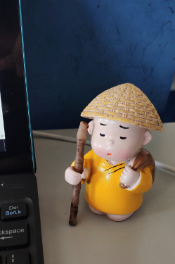

  

<h2 align="right">不管什么时候开始，开始了就不要停止</h2>

# dyngq 总览

## Notebooks

1. [卷积神经网络总结](https://github.com/dyngq/summary-notebooks-of-postgraduate/blob/master/%E7%A0%94%E7%A9%B6%E7%94%9F%E5%AD%A6%E4%B9%A0%E6%80%BB%E7%BB%93/%E5%8D%B7%E7%A7%AF%E7%A5%9E%E7%BB%8F%E7%BD%91%E7%BB%9C%20-%20Convolutional%20Neural%20Network-%20CNN.md)
2. [stacking总结](https://github.com/dyngq/summary-notebooks-of-postgraduate/blob/master/%E7%A0%94%E7%A9%B6%E7%94%9F%E5%AD%A6%E4%B9%A0%E6%80%BB%E7%BB%93/%E6%A8%A1%E5%9E%8B%E8%9E%8D%E5%90%88%E7%AE%97%E6%B3%95%EF%BC%88%E4%B8%89%EF%BC%89stacking.md)
3. [统计学习方法笔记](https://github.com/dyngq/summary-notebooks-of-postgraduate/tree/master/%E7%BB%9F%E8%AE%A1%E5%AD%A6%E4%B9%A0%E6%96%B9%E6%B3%95)
4. [李宏毅机器学习笔记](https://github.com/dyngq/summary-notebooks-of-postgraduate/tree/master/%E6%9D%8E%E5%AE%8F%E6%AF%85%E6%9C%BA%E5%99%A8%E5%AD%A6%E4%B9%A0%E7%AC%94%E8%AE%B0)
5. [Papers_NLP方向论文笔记](https://github.com/dyngq/summary-notebooks-of-postgraduate/blob/master/Papers_NLP/readme.md)
6. [Papers_CV方向论文笔记](https://github.com/dyngq/summary-notebooks-of-postgraduate/blob/master/Papers_CV/readme.md)
7. 比较完整全面的总结将会放在这一部分，其他的学习思考会放在Daily-log里面

## Projects

1. [本科毕业设计：基于深度学习与词嵌入的情感分析系统设计与实现](https://github.com/dyngq/sentiment-analysis-project)

## Competitions

1. [201903_研究生入学考试复试PTA机试_刷题](https://github.com/dyngq/Competitions/tree/master/201903_%E7%A0%94%E7%A9%B6%E7%94%9F%E5%85%A5%E5%AD%A6%E8%80%83%E8%AF%95_%E5%A4%8D%E8%AF%95_PTA%E6%9C%BA%E8%AF%95)
2. [201904_Datacon大数据安全比赛](https://github.com/dyngq/Competitions/tree/master/201904_Datacon%E5%A4%A7%E6%95%B0%E6%8D%AE%E5%AE%89%E5%85%A8%E6%AF%94%E8%B5%9B)
3. [201907_绿色计算大赛](https://github.com/dyngq/Competitions/tree/master/201907_%E7%BB%BF%E8%89%B2%E8%AE%A1%E7%AE%97%E5%A4%A7%E8%B5%9B)

## Daily_logs

1. [2019-06-05_廉老师让思考的关于模型对于具体问题的选择问题](https://github.com/dyngq/daily-log/blob/master/daily-logs/2019-06-05_廉老师让思考的关于模型对于具体问题的选择问题.md)
2. [2019-06-06_一个印地语的情感分析的预选赛](https://github.com/dyngq/daily-log/blob/master/daily-logs/2019-06-06_一个印地语的情感分析的预选赛.ipynb)
3. [2019-07-21_关于贝叶斯相关概率论知识的学习与简单总结.md](https://github.com/dyngq/daily-log/blob/master/daily-logs/2019-07-21_关于贝叶斯相关概率论知识的学习与简单总结.md)
4. [2019-07-22_服务器搭建博客总结](https://github.com/dyngq/daily-log/blob/master/daily-logs/2019-07-22_服务器搭建博客总结.md)
5. [2019-09-16_尝试破解WiFi密码](https://github.com/dyngq/daily-log/blob/master/daily-logs/2019-09-16_尝试破解WiFi密码.md)

  

<h2 align="right">但行好事，莫问前程</h2>
<h2 align="right">dyngq</h2>
